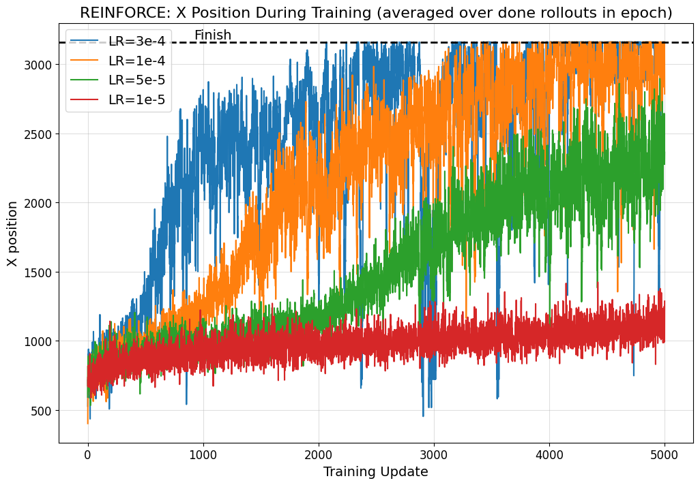
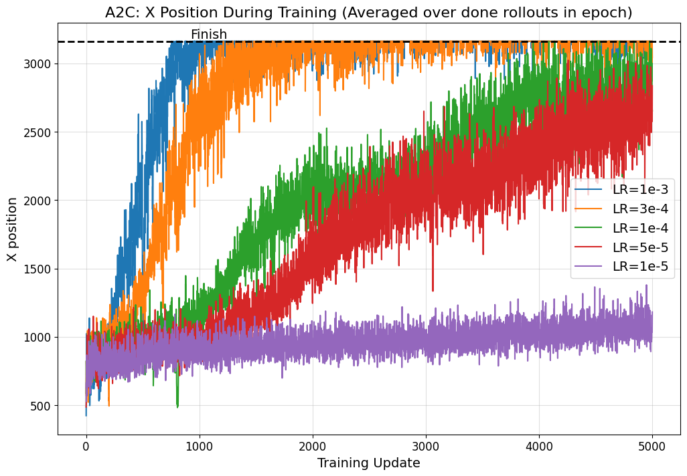
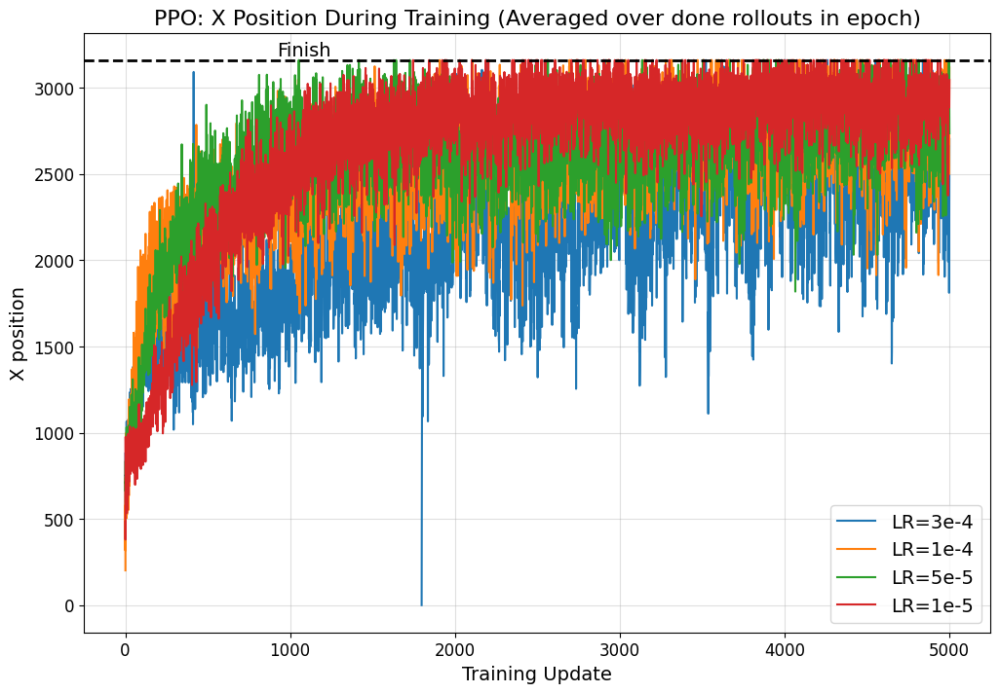
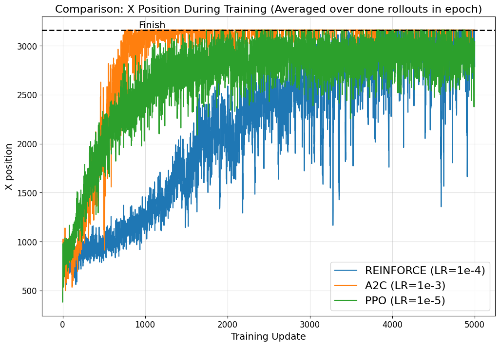

# Policy Gradient Methods for Super Mario Bros

A PyTorch implementation of three policy gradient reinforcement learning algorithms — **REINFORCE**, **A2C (Advantage Actor-Critic)** and **PPO (Proximal Policy Optimization)** — trained and evaluated on the Super Mario Bros NES environment. The agent learns to play World 1-1 from raw pixels, achieving up to **100% success rate** (A2C) across 20 evaluation episodes.

<p align="center">
  
</p>
<p align="center"><em>A2C agent completing World 1-1 (stochastic policy)</em></p>

---

## Environment

The environment is **SuperMarioBros-1-1-v0** from [`gym-super-mario-bros`](https://github.com/Kautenja/gym-super-mario-bros), an OpenAI Gym interface to the NES emulator [`nes-py`](https://github.com/Kautenja/nes-py). The agent controls Mario in World 1-1 with a single life, and the objective is to reach the flag at $x = 3161$ as fast as possible without dying.

| Property | Value |
|---|---|
| Base environment | `SuperMarioBros-1-1-v0` |
| Observation space | `Box(0, 255, (4, 84, 84), float32)` |
| Action space | `Discrete(7)` — `SIMPLE_MOVEMENT` |
| Frame skip | 4 (action repeated for 4 NES frames) |
| Transition dynamics | **Stochastic** — the NES emulator introduces frame-level variability |

### Wrapper Pipeline

The raw environment is wrapped with three layers before the agent interacts with it:

$$\text{NES env} \xrightarrow{\texttt{JoypadSpace}} \text{7 actions} \xrightarrow{\texttt{CustomReward}} \text{shaped reward + grayscale 84×84} \xrightarrow{\texttt{CustomSkipFrame}} \text{4-frame stack}$$

1. **`JoypadSpace(env, SIMPLE_MOVEMENT)`** — reduces the full 256-button NES action space to 7 composite actions
2. **`CustomReward(env)`** — converts frames to 84×84 grayscale, normalizes to $[0,1]$, and applies custom reward shaping (see below)
3. **`CustomSkipFrame(env, skip=4)`** — repeats each action for 4 NES frames, keeps the pixel-wise max of the last 2 frames (to handle NES sprite flickering), and stacks 4 such processed frames into the observation

### State Space

The agent observes a tensor of 4 stacked grayscale frames:

$$s_t \in \mathbb{R}^{4 \times 84 \times 84}, \quad s_t^{(i)} \in [0, 1]$$

Each frame undergoes:
1. **Grayscale** conversion (RGB → single channel via OpenCV)
2. **Resize** to $84 \times 84$ pixels
3. **Normalization** by dividing by 255

The 4-frame stack gives the agent access to temporal information (velocity, trajectory of objects) without recurrence.

### Action Space

The `SIMPLE_MOVEMENT` action set maps 7 discrete indices to NES joypad button combinations:

| Index | Buttons | Effect |
|---|---|---|
| 0 | `NOOP` | Stand still |
| 1 | `right` | Walk right |
| 2 | `right + A` | Jump right |
| 3 | `right + B` | Run right |
| 4 | `right + A + B` | Running jump right |
| 5 | `A` | Jump in place |
| 6 | `left` | Walk left |

Due to frame skipping ($k=4$), each selected action is held for 4 consecutive NES frames before the next decision.

### Transition Dynamics

At each agent step the following occurs:

1. The selected action $a_t$ is sent to the NES emulator
2. The emulator advances **4 NES frames** (frame skip), executing $a_t$ on each
3. The pixel-wise maximum of the **last 2 frames** is taken (removes sprite flicker)
4. This max-frame is preprocessed (grayscale, resize, normalize) and pushed onto the 4-frame stack
5. Rewards from all 4 sub-steps are **summed** into a single step reward

Transitions are **stochastic**: the NES emulator is not perfectly deterministic — slight timing variations in the emulation produce different enemy positions and game states across runs with identical action sequences. This means the agent must learn a robust policy rather than memorizing a fixed trajectory.

### Episode Termination

An episode ends when any of the following occurs:

| Condition | Trigger | `done` | `info["flag_get"]` |
|---|---|---|---|
| **Success** | Mario reaches the flag ($x_{\text{pos}} = 3161$) | `True` | `True` |
| **Death** | Mario falls into a pit, collides with an enemy, etc. | `True` | `False` |
| **Timeout** | The in-game 400-second timer expires | `True` | `False` |

There is no separate truncation signal — all three conditions set `done = True`. The `flag_get` field in the `info` dictionary distinguishes success from failure.

### Reward Function

#### Base NES Reward

The underlying `gym-super-mario-bros` environment computes a reward from three components:

$$r_{\text{base}} = v + c + d$$

| Component | Formula | Description |
|---|---|---|
| Velocity $v$ | $x_1 - x_0$ | Horizontal displacement (positive = rightward) |
| Clock penalty $c$ | $c_0 - c_1$ | Time penalty (negative when clock ticks) |
| Death penalty $d$ | $0$ if alive, $-15$ if dead | Discourages dying |

The base reward is clipped to $[-15, 15]$.

#### Custom Reward Shaping

On top of the base reward, `CustomReward` **replaces** the reward with a score-based shaping scheme:

$$r_t = \frac{1}{10}\left(\frac{\Delta\text{score}}{40} + r_{\text{terminal}}\right)$$

| Event | Reward (before $\frac{1}{10}$ scaling) |
|---|---|
| Each step | (score_t - score_t-1) / 40 — scaled in-game score increase |
| Reaching the flag (`flag_get = True`) | $+50$ |
| Dying (`done = True, flag_get = False`) | $-50$ |

The in-game score increases when Mario collects coins, defeats enemies, and hits bonus blocks — this provides a denser signal than pure x-position progress. The large terminal bonuses ($\pm 50$) create a strong gradient toward level completion and away from death. The final $\frac{1}{10}$ scaling keeps reward magnitudes manageable for neural network training.

### `info` Dictionary

Each `step()` returns an `info` dict with the following fields from the NES emulator:

| Key | Type | Description |
|---|---|---|
| `x_pos` | `int` | Mario's horizontal position in the level |
| `y_pos` | `int` | Mario's vertical position |
| `score` | `int` | Cumulative in-game score |
| `coins` | `int` | Number of collected coins |
| `time` | `int` | Remaining time on the in-game clock (starts at 400) |
| `stage` | `int` | Current stage (1–4) |
| `world` | `int` | Current world (1–8) |
| `life` | `int` | Lives remaining (3, 2, or 1) |
| `status` | `str` | `"small"`, `"tall"`, or `"fireball"` |
| `flag_get` | `bool` | `True` if Mario reached the flag |

---

## Model Architecture

All three algorithms share the same **Actor-Critic** convolutional neural network:

| Layer | Details |
|---|---|
| Conv2d → ReLU | 4 → 32 filters, 3×3, stride 2, padding 1 |
| Conv2d → ReLU | 32 → 32 filters, 3×3, stride 2, padding 1 |
| Conv2d → ReLU | 32 → 32 filters, 3×3, stride 2, padding 1 |
| Conv2d → ReLU | 32 → 32 filters, 3×3, stride 2, padding 1 |
| Linear | 32×6×6 → 512 |
| Actor head | 512 → Num Actions (logits) |
| Critic head | 512 → 1 (state value) |

Weights are initialized with **orthogonal initialization** (gain = $\sqrt{2}$ for ReLU), biases set to zero.

---

## Methods

All methods collect rollouts from **8 parallel environments** over **512 local steps** per update, yielding $8 \times 512 = 4096$ transitions per training update. Actions are sampled from a categorical distribution over softmax-normalized logits. An **entropy bonus** ($\beta = 0.01$) encourages exploration. Gradients are clipped to max norm 0.5.

---

### REINFORCE

REINFORCE is the simplest policy gradient method. It uses **Monte Carlo returns** — the full discounted cumulative reward from each time step — to weight the log-probability of actions. No value function baseline is used for variance reduction; only the raw return $G_t$ scales the gradient.

The policy gradient is:

$$\nabla_\theta J(\theta) = \mathbb{E}_{\tau \sim \pi_\theta} \left[ \sum_{t=0}^{T} \nabla_\theta \log \pi_\theta(a_t | s_t)  G_t \right]$$

where the return is computed as:

$$G_t = \sum_{k=0}^{T-t} \gamma^k r_{t+k+1}$$

The total loss includes an entropy regularization term:

$$\mathcal{L} = -\frac{1}{N} \sum_i \log \pi_\theta(a_i | s_i)  G_i - \beta  H(\pi_\theta)$$

```
Algorithm: REINFORCE
─────────────────────────────────────────────────────────
Initialize policy network π_θ
For each update:
    Collect T steps from N parallel environments using π_θ
    For each (s_t, a_t, r_t, done_t):
        Compute Monte Carlo return G_t (no bootstrapping):
            G_T = 0
            For t = T-1, ..., 0:
                G_t = r_t + γ · G_{t+1} · (1 - done_t)

    policy_loss = -mean( log π_θ(a_t | s_t) · G_t )
    entropy     =  mean( H(π_θ(· | s_t)) )
    total_loss  =  policy_loss - β · entropy

    Update θ by ∇_θ total_loss  (with grad clipping)
```

---

### A2C (Advantage Actor-Critic)

A2C extends REINFORCE by introducing a **learned value function** $V_\phi(s)$ as a baseline. Instead of scaling gradients by raw returns, it uses the **advantage** $A_t = R_t - V_\phi(s_t)$, which dramatically reduces variance while remaining unbiased.

The advantage is computed using **n-step TD returns** with bootstrapping from the critic:

$$R_t = r_t + \gamma r_{t+1} + \cdots + \gamma^{n-1} r_{t+n-1} + \gamma^n V_\phi(s_{t+n})$$

$$A_t = R_t - V_\phi(s_t)$$

The total loss combines actor, critic, and entropy terms:

$$\mathcal{L} = \underbrace{-\frac{1}{N}\sum_i \log \pi_\theta(a_i|s_i)  A_i}_{\text{actor loss}} + \underbrace{\text{SmoothL1}(V_\phi(s_i), R_i)}_{\text{critic loss}} - \beta  H(\pi_\theta)$$

```
Algorithm: A2C (Advantage Actor-Critic)
─────────────────────────────────────────────────────────
Initialize actor-critic network (π_θ, V_φ)
For each update:
    Collect T steps from N parallel environments using π_θ
    Bootstrap: V_next = V_φ(s_T)

    Compute n-step TD returns (backwards):
        R_T = V_next
        For t = T-1, ..., 0:
            R_t = r_t + γ · R_{t+1} · (1 - done_t)

    A_t = R_t - V_φ(s_t)              (advantage, detached)

    actor_loss  = -mean( log π_θ(a_t | s_t) · A_t )
    critic_loss =  SmoothL1( V_φ(s_t), R_t )
    entropy     =  mean( H(π_θ(· | s_t)) )
    total_loss  =  actor_loss + critic_loss - β · entropy

    Update θ, φ by ∇ total_loss  (with grad clipping)
```

---

### PPO (Proximal Policy Optimization)

PPO improves upon A2C by preventing destructively large policy updates. It saves the **old policy** before each update and constrains the new policy to stay close via a **clipped surrogate objective**. This allows multiple epochs of mini-batch optimization on the same rollout data without instability.

Advantages are estimated using **Generalized Advantage Estimation (GAE)**:

$$\hat{A}_t^{\text{GAE}} = \sum_{l=0}^{T-t} (\gamma \lambda)^l \delta_{t+l}, \quad \delta_t = r_t + \gamma V_\phi(s_{t+1}) - V_\phi(s_t)$$

The clipped surrogate objective is:

$$\mathcal{L}^{\text{CLIP}} = -\mathbb{E}\left[\min\left(r_t(\theta)\hat{A}_t, \text{clip}(r_t(\theta), 1-\epsilon, 1+\epsilon)\hat{A}_t\right)\right]$$

where $r_t(\theta) = \frac{\pi_\theta(a_t|s_t)}{\pi_{\theta_{\text{old}}}(a_t|s_t)}$ is the importance sampling ratio and $\epsilon = 0.2$.

```
Algorithm: PPO (Proximal Policy Optimization)
─────────────────────────────────────────────────────────
Initialize actor-critic network (π_θ, V_φ)
For each update:
    Collect T steps from N parallel environments using π_θ
    Store old log-probs: log π_old(a_t | s_t)

    Compute GAE advantages (backwards):
        gae = 0
        For t = T-1, ..., 0:
            δ_t = r_t + γ · V_φ(s_{t+1}) · (1 - done_t) - V_φ(s_t)
            gae = δ_t + γ · λ · gae
            R_t = gae + V_φ(s_t)
        A_t = R_t - V_φ(s_t)

    For epoch = 1, ..., K:
        Shuffle data into M mini-batches
        For each mini-batch:
            ratio = exp( log π_θ(a|s) - log π_old(a|s) )
            surr1 = ratio · A
            surr2 = clip(ratio, 1-ε, 1+ε) · A

            actor_loss  = -mean( min(surr1, surr2) )
            critic_loss =  SmoothL1( V_φ(s), R )
            entropy     =  mean( H(π_θ(· | s)) )
            total_loss  =  actor_loss + critic_loss - β · entropy

            Update θ, φ by ∇ total_loss  (with grad clipping)
```

---

## Hyperparameters

| Parameter | REINFORCE | A2C | PPO |
|---|---|---|---|
| Best learning rate | $1 \times 10^{-4}$ | $1 \times 10^{-3}$ | $1 \times 10^{-5}$ |
| Discount $\gamma$ | 0.9 | 0.9 | 0.9 |
| Entropy coeff $\beta$ | 0.01 | 0.01 | 0.01 |
| Rollout length $T$ | 512 | 512 | 512 |
| Parallel envs $N$ | 8 | 8 | 8 |
| Optimizer | Adam | Adam | Adam |
| Grad clip norm | 0.5 | 0.5 | 0.5 |
| GAE $\lambda$ | — | — | 1.0 |
| Clip $\epsilon$ | — | — | 0.2 |
| PPO epochs $K$ | — | — | 10 |
| PPO mini-batches $M$ | — | — | 16 |
| Random seed | 123 | 123 | 123 |

---

## Experiments

### Training Curves

Each plot shows the agent's **mean X position** (Y-axis) over **training updates** (X-axis). The X position is averaged over all finished or terminated rollouts sampled during the current epoch. Each training update corresponds to all gradient steps for one epoch of rollouts. The dashed horizontal line at $x = 3161$ marks the **finish line** (flag position). Multiple learning rates are compared in each plot.

#### REINFORCE

Best training run: **LR = $1 \times 10^{-4}$**.

<p align="center">
  
</p>

REINFORCE, using only Monte Carlo returns without a value baseline, shows the **noisiest** learning among the three methods. With LR=$1\times10^{-4}$ the agent gradually progresses through the level and occasionally reaches the finish, though the curve remains highly volatile throughout training. Higher learning rates ($3\times10^{-4}$) lead to too big Variance in updates, while lower ones ($1\times10^{-5}$, $5\times10^{-5}$) learn too slowly to show meaningful progress within 5000 updates.

#### A2C

Best training run: **LR = $1 \times 10^{-3}$**.

<p align="center">
  
</p>

A2C benefits from the learned value baseline, resulting in **lower variance** compared to REINFORCE. With LR=$1\times10^{-3}$ the agent converges to consistently reaching the finish line well before 2000 updates. Smaller learning rates ($1\times10^{-4}$, $3\times10^{-4}$) still converge but more slowly, while LR=$1\times10^{-5}$ and $5\times10^{-5}$ show limited progress. The advantage of variance reduction through the critic is clearly visible in the smoother learning curves.

#### PPO

Best training run: **LR = $1 \times 10^{-5}$**.

<p align="center">
  
</p>

PPO requires a **much smaller learning rate** ($1\times10^{-5}$) because it performs 10 epochs of mini-batch optimization per rollout — effectively taking many more gradient steps per data collection cycle. Despite the lower learning rate, PPO achieves steady, monotonic improvement and converges to the finish line. Larger learning rates ($5\times10^{-5}$ and above) cause instability due to the compounding effect of multiple optimization epochs.

### Comparison

<p align="center">
  
</p>

Comparison of the best run for each algorithm. A2C (LR=$1\cdot ^{-3}$) converges the fastest, reaching the finish line in under 2000 updates. PPO (LR=$1\times10^{-5}$) achieves a smooth, steady trajectory. REINFORCE (LR=$1\times10^{-4}$) is the noisiest and slowest to converge, as expected from a method without a value baseline.

---

## Evaluation Results

Each model was evaluated on **20 stochastic rollouts** (actions sampled from the policy distribution) on World 1-1.

| Algorithm | Checkpoint | Success Rate | Avg X Position | Avg Return | Avg Time (successful) |
|---|---|---|---|---|---|
| **A2C** (LR=1e-3) | update 5000 | **100%** (20/20) | **3161.0** | **314.8** | 55.0s |
| **PPO** (LR=1e-5) | update 5000 | 90% (18/20) | 2979.2 | 293.8 | 54.1s |
| **REINFORCE** (LR=1e-4) | update 5000 | 80% (16/20) | 2874.2 | 281.1 | 65.1s |

A2C achieves **perfect completion rate** with the most consistent behavior. PPO reaches 90% with very fast completions. REINFORCE reaches 80% but with higher variance in completion times.

### Trained Agent Demos

<table>
  <tr>
    <td align="center"><b>PPO</b> (LR=1e-5, update 8750)</td>
    <td align="center"><b>A2C</b> (LR=1e-3, update 5000)</td>
    <td align="center"><b>REINFORCE</b> (LR=1e-4, update 5000)</td>
  </tr>
  <tr>
    <td align="center"></td>
    <td align="center"></td>
    <td align="center"></td>
  </tr>
  <tr>
    <td align="center">90% success rate</td>
    <td align="center">100% success rate</td>
    <td align="center">80% success rate</td>
  </tr>
</table>

---

## Project Structure

```
├── ppo_train.py           # PPO training script
├── a2c_train.py           # A2C training script
├── reinforce_train.py     # REINFORCE training script
├── test.py                # Evaluation script (all algorithms)
├── src/
│   ├── model.py           # ActorCritic CNN architecture
│   ├── env.py             # Environment wrappers and parallel envs
│   └── process.py         # Live evaluation during training
├── scripts/
│   ├── train.sh           # Example training commands
│   └── eval.sh            # Example evaluation commands
├── images/                # Training curve plots
├── results/               # Evaluation GIFs and logs
├── plot.ipynb             # Notebook for generating plots
└── requirements.txt       # Python dependencies
```

---

## Usage

### Install

```bash
pip install -r requirements.txt
```

### Train

Each algorithm has its own training script. Training logs metrics to CSV files and saves checkpoints periodically.

**PPO:**
```bash
python ppo_train.py --world 1 --stage 1 --lr 1e-5 --experiment ppo_mario_lr1e-5
```

**A2C:**
```bash
python a2c_train.py --world 1 --stage 1 --lr 1e-3 --experiment a2c_mario_lr1e-3
```

**REINFORCE:**
```bash
python reinforce_train.py --world 1 --stage 1 --lr 1e-4 --experiment reinforce_mario_lr1e-4
```

To use GPU, set `CUDA_VISIBLE_DEVICES`:
```bash
CUDA_VISIBLE_DEVICES=0 python ppo_train.py --world 1 --stage 1 --lr 1e-5 --experiment ppo_mario_lr1e-5
```

**Training outputs:**
- Checkpoints saved to `checkpoints/<experiment>/` every 50 updates
- Training logs saved to `logs/<experiment>/train.csv` and `train_updates.csv`

### Evaluate

The evaluation script loads a trained checkpoint, runs multiple episodes, and produces a GIF of the best trajectory along with per-episode statistics.

```bash
python test.py <checkpoint_path> --episodes 20 --stochastic --log-dir results/my_eval --gif-path eval_result.gif
```

**Key flags:**
- `--stochastic`: sample from the policy distribution (default: deterministic argmax)
- `--episodes N`: number of evaluation rollouts
- `--max-steps N`: max steps per episode (default: 10000)

**Evaluation outputs:**
- `eval_result.gif` — GIF of the best trajectory
- `eval_results.csv` — per-episode metrics
- `eval_summary.json` — aggregate statistics
